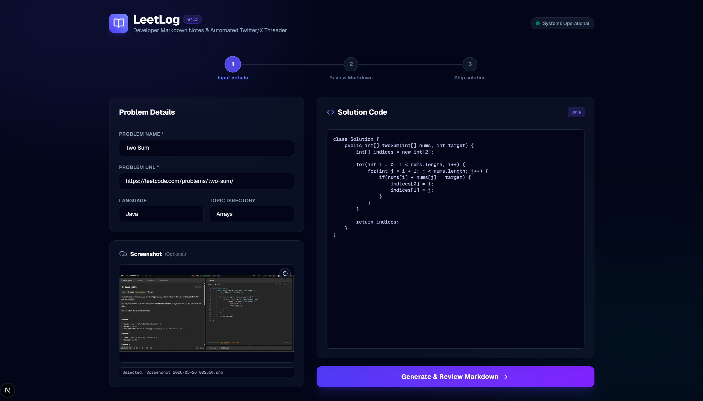
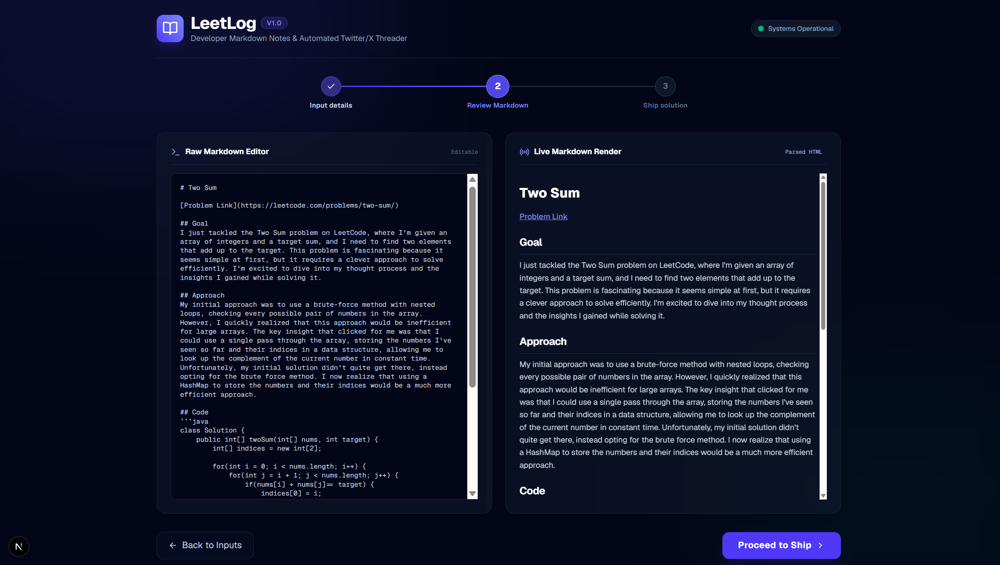
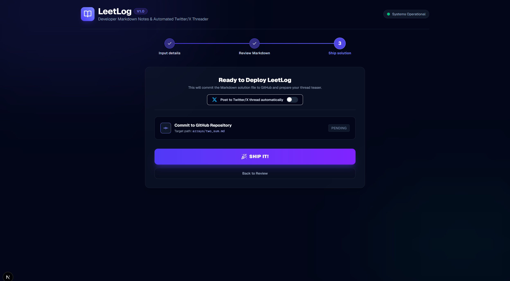

# 📔 LeetLog

> **Transform your LeetCode solutions into elegant personal markdown notes, commit them directly to GitHub, and share your streak on X/Twitter—all in one seamless workflow.**

---

LeetLog is a highly interactive, premium dark-mode developer companion designed to streamline LeetCode logging and social sharing. Built for developers who want to keep an elegant journal of their daily problem-solving process, LeetLog uses **Groq AI API** to write first-person, reflective developer notes from raw code. The app automatically pushes these entries into topic-based folders in a dedicated GitHub repository, uploads optional screenshots to **Cloudinary**, and compiles custom thread teasers for automated or manual **Twitter/X** sharing.

---

## 🚀 Features

*   **AI-Powered Developer Diaries**: Translates raw solution code and problem specs into engaging, first-person narrative journals focusing on key insights and algorithmic breakthroughs using `llama-3.3-70b-versatile`.
*   **Structured GitHub Repository Integration**: Dynamically commits markdown diary entries directly into topic-based folders (e.g. `arrays/`, `dynamic_programming/`, `trees/`) using clean snake_case filenames.
*   ** Cloudinary Screenshot Hosting**: Uploads optional screenshot files to Cloudinary using their unsigned REST API, replacing local relative image paths with high-performance `secure_url` image links inside the committed GitHub markdown.
*   **Optional Twitter/X Auto-Threading**: Auto-detects your Twitter API environment variables and displays an active toggle switch to auto-post your tweet as a reply in an ongoing thread using Tweepy.
*   **Custom Manual Share**: If unconfigured or toggled off, displays a premium manual sharing text box showing a lowercase `day [x]` teaser + direct GitHub URL with a one-click Copy to Clipboard button and inline day count selector.
*   **State-Driven Stepper Flow**: A beautiful 3-step dashboard (**Input ➡️ Review ➡️ Ship**) utilizing **Framer Motion spring animations** and glowing step indicators.

---

## 🛠️ Tech Stack

*   **Frontend**: Next.js 16 (App Router), React 19, TypeScript
*   **Styling & Icons**: TailwindCSS v4, Lucide Icons
*   **Animations**: Framer Motion
*   **Markdown Parsing**: marked
*   **AI Engine**: Groq AI API (`@groq-sdk`)
*   **Twitter Integrations**: Tweepy (Python 3), Node Child Process Spawning
*   **Image Cloud Hosting**: Cloudinary REST Upload API

---

## ⚙️ Environment Variables

Copy the `.env.example` in the project root to `.env` and fill in your keys:

```bash
cp .env.example .env
```

Here is a full breakdown of the required and optional parameters:

| Variable | Description | Required / Optional |
| :--- | :--- | :--- |
| `GROQ_API_KEY` | Your Groq AI API Key used to generate the Developer Markdown notes. | **Required** |
| `GITHUB_TOKEN` | A Personal Access Token (PAT) with `repo` scope to commit notes directly to your repository. | **Required** |
| `GITHUB_REPO_OWNER` | Your GitHub account username. | **Required** |
| `GITHUB_REPO_NAME` | The target GitHub repository where markdown solutions will be saved. | **Required** |
| `CLOUDINARY_CLOUD_NAME` | Your Cloudinary account cloud identifier. | **Optional** (Required for screenshots) |
| `CLOUDINARY_UPLOAD_PRESET` | An active unsigned upload preset configured in your Cloudinary upload settings. | **Optional** (Required for screenshots) |
| `TWITTER_API_KEY` | Your Twitter developer app consumer API Key. | **Optional** (Required for auto-posting) |
| `TWITTER_API_SECRET` | Your Twitter developer app consumer API Secret. | **Optional** (Required for auto-posting) |
| `TWITTER_ACCESS_TOKEN` | Your Twitter developer account User Access Token. | **Optional** (Required for auto-posting) |
| `TWITTER_ACCESS_TOKEN_SECRET` | Your Twitter developer account User Access Token Secret. | **Optional** (Required for auto-posting) |
| `TWITTER_LAST_THREAD_TWEET_ID` | The ID of the last tweet in your thread. The Python script auto-replies to this ID and overwrites it. | **Optional** (Required for auto-posting) |

---

## 🚀 Quick Start

### 1. Prerequisites
Ensure you have **Node.js 18+**, **Python 3.8+**, and **pip** installed on your system.

### 2. Install Project Dependencies
Run npm install in the project root:
```bash
npm install
```

Install Python dependencies for Twitter auto-threading:
```bash
pip install -r requirements.txt
```

### 3. Setup Credentials
Copy the environment template and populate your credentials in `.env`:
```bash
cp .env.example .env
```

### 4. Run Development Server
Boot up the local Next.js environment:
```bash
npm run dev
```
Open [http://localhost:3000](http://localhost:3000) in your browser.

---

## 📖 Usage Guide

LeetLog splits the logging workflow into three clear steps, guided by the interactive stepper component at the top of the dashboard.

### Step 1: Input Details
Provide the basic metadata of the LeetCode problem you solved:
1. Enter the **Problem Name** and **LeetCode URL**.
2. Select the **Programming Language** and matching **Topic Directory** (folder classification).
3. (Optional) Drag & drop or select an image file to upload a screenshot of your correct submission.
4. Paste your correct **Solution Code** in the textarea, then click **Generate**.



### Step 2: Review Diary
Review the content generated by the Google Gemini AI model:
1. On the left, use the **Raw Markdown Editor** to modify the Developer Markdown or approach narrative directly.
2. On the right, verify the formatted HTML output in the **Live Markdown Render** box, then click **Proceed to Ship**.



### Step 3: Ship Solution
Deploy your solution directly to GitHub and share:
1. (Optional) If Twitter API keys are set, choose whether to check the **Post to Twitter/X thread automatically** toggle.
2. Click the glowing **SHIP IT!** button.
3. LeetLog will:
   * Upload the screenshot to Cloudinary and embed the `secure_url` in your markdown.
   * Commit the complete Markdown solution file directly to GitHub.
   * (If auto-post is enabled) Auto-reply to your Twitter thread using Tweepy, showing a direct link to the new tweet.
   * (If auto-post is disabled/unconfigured) Present a **manual Copy Post card** where you can adjust your streak day count inline and copy the formatted lowercase post text to your clipboard.



---

## 🤝 Contributing

Contributions are what make the open source community such an amazing place to learn, inspire, and create. Any contributions you make are **greatly appreciated**.

1. Fork the Project
2. Create your Feature Branch (`git checkout -b feature/AmazingFeature`)
3. Commit your Changes (`git commit -m 'Add some AmazingFeature'`)
4. Push to the Branch (`git push origin feature/AmazingFeature`)
5. Open a Pull Request

---

## 📄 License

Distributed under the MIT License. See `LICENSE` for more information.
